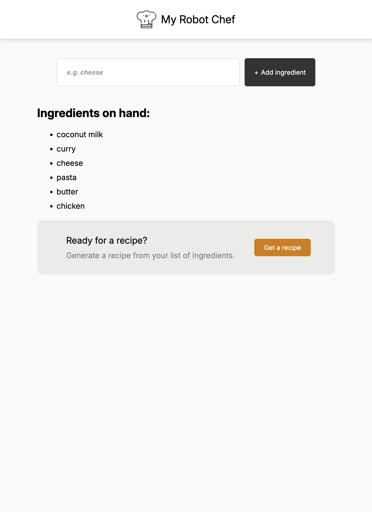
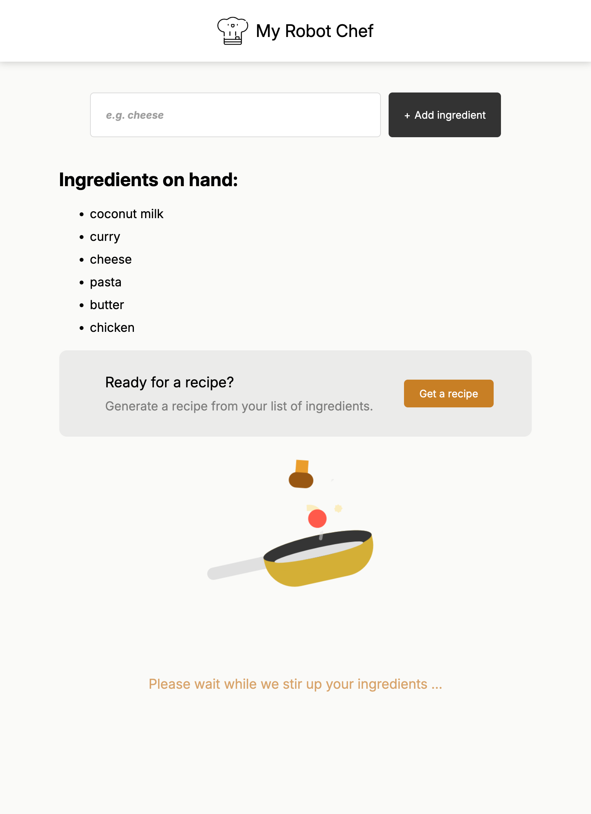
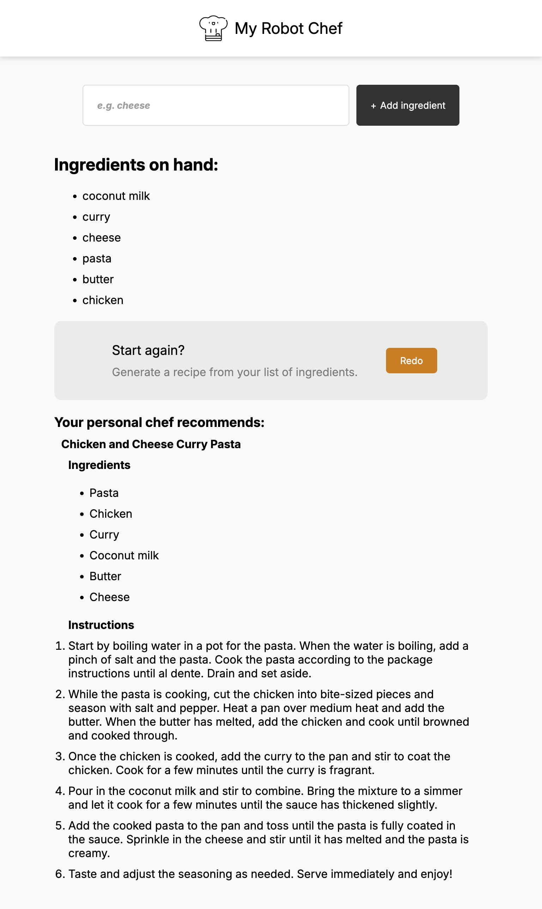

# Chef AI 🤖🧑‍🍳

Stuck on what to cook for dinner? Just enter the ingredients you have, and get instant recipe suggestions!

## Table of contents

- [Overview](#overview)
- [Screenshot](#screenshot)
- [Built with](#built-with)
- [What I learnt](#what-i-learnt)
- [Possible improvements](#possible-improvements)

## Overview

Users should be able to:
- Enter ingredients.
- See recommended recipes for the ingredients.
- Click Redo button to start again.
- See animation when loading.

### Screenshot

|Tablet 768px|
| ---------------------------------------------- |
|     <a href="screenshots/Tablet768-1-prompt.png"></a>   |
|     <a href="screenshots/Tablet768-2-loading.png"></a> |
|     <a href="screenshots/Tablet768-3-recipe.png"></a>   |


### Built with

- Semantic HTML5 markup
- CSS custom properties
- Flexbox
- CSS Grid
- Mobile-first workflow
- [React](https://reactjs.org/) - JS library

### What I learnt
1. How to get value from .env

   [Reference](https://stackoverflow.com/a/74683249)

    Save secrets in .env in root directory:
   ```.env
   // Must prefix key with `VITE_`
   // No need quotes

   VITE_MY_ACCESS_TOKEN=a_very_secret_key
   ```

   Accessing from JSX:
   ```jsx
   const hf = new HfInference(import.meta.env.VITE_MY_ACCESS_TOKEN);
   ```


### Possible improvements
- Share recipes to Whatsapp/ Telegram etc.
- Save recipe to local storage.
- Toggle to different language.


# Credits
- The course: <a href="https://scrimba.com/learn-react-c0e">Scrimba React course</a>
- The Chef logo: <a href="https://www.freepik.com/icons/chef">Icon by Freepik</a>